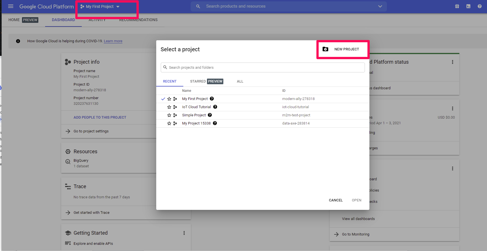
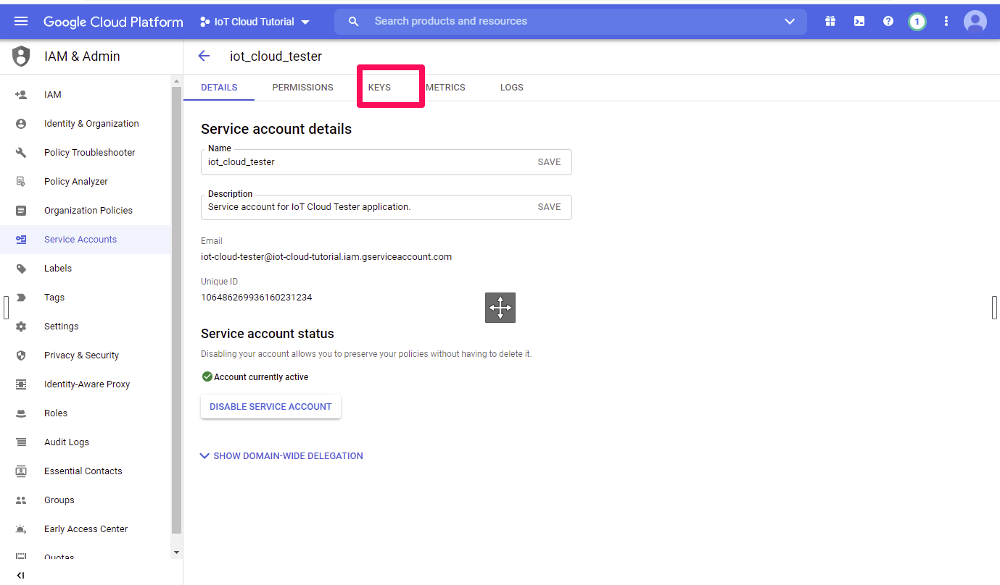

🇬🇧 [English](./Vision-API-Tutorial.md) | 🇹🇼 [繁體中文](./Vision-API-Tutorial-zh-tw.md)

# Google Cloud Vision API Setup Tutorial

This tutorial will guide you through setting up the Google Cloud Vision API.

## Step 1: Create a Google Cloud Project

1. **Go to the Google Cloud Console**.
   - Open your web browser and navigate to the [Google Cloud Console](https://console.cloud.google.com/).

2. **Create a New Project**.
   - Click on the project dropdown at the top of the page.
   - Select "New Project" and fill in the details.
   - Click "Create".

   

## Step 2: Enable the Vision API

1. **Open the API Library**.
   - In the Cloud Console, go to the "APIs & Services" > "Library".

2. **Search for the Vision API**.
   - Type "Vision" in the search bar and select "Cloud Vision API".

3. **Enable the API**.
   - Click the "Enable" button.

   

## Step 3: Create a Service Account and Download the Key

1. **Create a Service Account**.
   - Navigate to "IAM & Admin" > "Service accounts".
   - Click "Create Service Account".
   - Fill in the details and click "Create".

2. **Assign Roles**.
   - Assign the necessary roles (e.g., "Viewer", "Editor") and click "Continue".

3. **Generate and Download the Key**.
   - Click on the created service account.
   - Go to the "Keys" tab and click "Add Key" > "Create new key".
   - Choose "JSON" and click "Create". The key file will download automatically.

   

## Step 4: Set Environment Variable

1. **Set `GOOGLE_APPLICATION_CREDENTIALS`**.
   - On your local machine, set the environment variable to point to the downloaded JSON key file.
   - For example, in a Linux or macOS terminal, you can use:
     ```bash
     export GOOGLE_APPLICATION_CREDENTIALS="/path/to/your/keyfile.json"
     ```

That's it! You've successfully set up the Google Cloud Vision API.